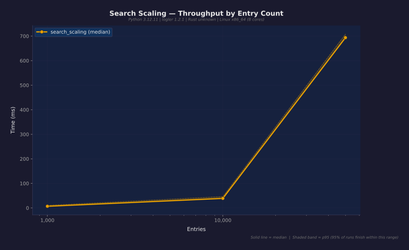

<p align="center">
  
</p>

<h3 align="center">Rust-powered log investigation for humans and AI agents</h3>

<p align="center">
  <a href="https://pypi.org/project/logler/"></a>
  <a href="https://pypi.org/project/logler/"></a>
  <a href="https://pypi.org/project/logler/"></a>
  <a href="https://opensource.org/licenses/MIT"></a>
  <a href="https://github.com/gabu-quest/logler/actions"></a>
</p>
<p align="center">
  <a href="https://www.rust-lang.org/"></a>
  <a href="https://github.com/psf/black"></a>
  <a href="https://github.com/astral-sh/ruff"></a>
  <a href="https://pypi.org/project/logler/"></a>
  <a href="https://github.com/gabu-quest/logler"></a>
</p>

<p align="center">
  English | <a href="README.ja.md">日本語</a>
</p>

---

## Install

```bash
pip install logler
```

Python 3.9+. Rust backend included for investigation features.

## Quick Start

**Python API:**

```python
import logler.investigate as investigate

results = investigate.search(files=["app.log"], level="ERROR", limit=5)
for entry in results["results"]:
    print(f"[{entry['entry']['level']}] {entry['entry']['message']}")
```

**CLI:**

```bash
logler llm search app.log --level ERROR --tail 5
```

## See It in Action

<!--

Generate with: vhs demo.tape
-->

```bash
git clone https://github.com/gabu-quest/logler.git && cd logler
uv run python demo.py
```

## Interactive Tours

Learn logler hands-on with [marimo](https://marimo.io) notebooks. Each tour is
self-contained with sample data -- no external files needed.

**[Launch Interactive Tour (browser)](https://gabu-quest.github.io/logler/)**

| Tour | Topics |
|------|--------|
| [01. Fundamentals](https://gabu-quest.github.io/logler/tour_01_fundamentals.html) | Search, filter, output formats |
| [02. Thread Tracking](https://gabu-quest.github.io/logler/tour_02_thread_tracking.html) | Grouping, correlation IDs |
| [03. Hierarchy](https://gabu-quest.github.io/logler/tour_03_hierarchy.html) | Tree views, waterfall, bottleneck |

<details>
<summary>All 17 tours</summary>

| Tour | Topics |
|------|--------|
| 01. Fundamentals | Search, filter, output formats |
| 02. Thread Tracking | Grouping, correlation IDs |
| 03. Hierarchy | Tree views, waterfall, bottleneck |
| 04. Investigation | Sessions, history, report generation |
| 05. Pattern Detection | Repeated patterns, frequency analysis |
| 06. Flamegraph | Performance visualization |
| 07. Error Flow | Root cause analysis, propagation chains |
| 08. Comparison | Diff hierarchies, compare threads |
| 09. Tracing Exports | Jaeger and Zipkin formats |
| 10. Sampling | Smart sampling strategies |
| 11. AI Insights | LLM investigation workflow |
| 12. Multi-File | Cross-service distributed tracing |
| 13. Live Watching | Real-time tailing, streaming |
| 14. Performance | 10K+ entries, benchmarks |
| 15. Filtering | Field filtering, complex queries |
| 16. Metrics | Numeric values, stats, anomaly detection |
| 17. Format Detection | Auto-detect formats, Drain template mining |

</details>

**Run locally:**

```bash
uv run marimo edit examples/tours/tour_01_fundamentals.py
```

## Why Logler?

Log files are the black box of production. `grep` finds strings but not stories.
Logler is a Rust-powered investigation engine that understands structure: threads,
correlations, traces, hierarchies. Use it from Python, the CLI, or as an AI agent's
investigation toolkit.

## Performance

Real numbers from the [benchmark suite](benchmarks/results/REPORT.md)
(14 scenarios, Python 3.12, Rust backend):

| Operation | Result | Context |
|-----------|--------|---------|
| Search throughput | **257K entries/sec** | Level filter, 10K entries |
| Follow thread | **2.6ms** | Correlation lookup, 1K entries |
| Cross-service timeline | **13ms** | 5 services, shared correlation |
| Error flow analysis | **1.7ms** | 10K entry hierarchy |
| Token savings | **2540x** | count vs full, 100 ERRORs |



Full report with 14 charts: [benchmarks/results/REPORT.md](benchmarks/results/REPORT.md)

**Honest limitations:**
- BSD syslog without `<priority>` prefix has no parsed timestamps
- Time-based filtering unavailable for entries without timestamps

## Features

**Core**
- Multi-format parser: JSON, syslog (RFC 3164/5424, BSD), logfmt, Apache CLF, plain text
- Thread tracking with correlation IDs and distributed traces
- Real-time file watching and tailing
- Rich terminal output with thread visualization

**Investigation** (Rust-powered)
- Hierarchy detection with tree, waterfall, flamegraph views
- Bottleneck analysis and error flow tracing
- Cross-service timeline reconstruction
- Pattern detection and smart sampling

**LLM-Optimized**
- 25 CLI commands with structured JSON output
- Token-efficient modes: summary, count, compact
- Investigation sessions with undo/redo and report generation
- Metrics extraction with z-score anomaly detection
- Format auto-detection with Drain template mining
- Custom formats and correlation rules via `.logler.toml`

## When to Use Logler

**Good fit:**
- Debugging production incidents (threads, correlations, traces)
- AI agent log investigation (LLM-first JSON CLI)
- Cross-service distributed tracing
- Quick triage of large log files

**Consider alternatives:**
- Need log aggregation/storage: ELK, Loki, Datadog
- Need real-time alerting: Prometheus + Alertmanager
- Only need grep-like search: ripgrep

## Showcase

### Thread Hierarchy

Build a request hierarchy from span/parent_span fields, with automatic bottleneck
detection:

```python
import logler.investigate as investigate

hierarchy = investigate.follow_thread_hierarchy(
    files=["app.log"],
    root_identifier="req-123",
    min_confidence=0.8,
)
if hierarchy.get("bottleneck"):
    bn = hierarchy["bottleneck"]
    print(f"Bottleneck: {bn['node_id']} ({bn['duration_ms']}ms)")
```

```
api-gateway (req-001, 520ms)
├─ auth-service (45ms)
│  ├─ jwt-validate (5ms)
│  └─ user-lookup (25ms)
├─ product-service (450ms) SLOW
│  ├─ inventory-check (340ms)
│  │  └─ db-query (300ms)
│  └─ cache-update (45ms) ERROR
└─ response-assembly (10ms)
```

[Full tour](https://gabu-quest.github.io/logler/tour_03_hierarchy.html) | [API reference](docs/API.md#c08)

### Cross-Service Timeline

Reconstruct a request's journey across microservices:

```python
timeline = investigate.cross_service_timeline(
    files={"api": ["api.log"], "db": ["db.log"], "cache": ["cache.log"]},
    correlation_id="req-12345",
)
for event in timeline["timeline"]:
    print(f"[{event['service']}] {event['entry']['message']}")
```

[Full tour](https://gabu-quest.github.io/logler/tour_12_multi_file_interleaving.html) | [API reference](docs/API.md#c04)

### Error Flow Analysis

Trace error propagation through the request hierarchy:

```python
error_flow = investigate.analyze_error_flow(
    files=["app.log"],
    root_identifier="req-123",
)
```

```
Error Flow Analysis

Root Cause:
  cache-update failed at 10:00:00.450Z
  Error: Redis connection refused
  Path: api-gateway -> product-service -> cache-update

Impact: 3 nodes affected, request degraded
Recommendation: Check Redis connectivity
```

[Full tour](https://gabu-quest.github.io/logler/tour_07_error_flow.html) | [API reference](docs/API.md)

## Visualization Modes

**Tree View** -- parent-child relationships:
```
api-gateway (req-001, 520ms)
├─ auth-service (45ms)
│  ├─ jwt-validate (5ms)
│  └─ user-lookup (25ms)
├─ product-service (450ms) SLOW
│  ├─ inventory-check (340ms)
│  │  └─ db-query (300ms)
│  └─ cache-update (45ms) ERROR
└─ response-assembly (10ms)
```

**Waterfall View** -- temporal overlap:
```
Timeline: req-001 (520ms)
api-gateway          ████████████████████████████████████████  520ms
  ├─ auth-service    ████                                      45ms
  ├─ product-service      ████████████████████████████████    450ms
  │  ├─ inventory              ██████████████████████         340ms
  │  └─ cache-update                              ████ ERR     45ms
  └─ response                                          ██      10ms
```

**Flamegraph View** -- time distribution:
```
┌────────────────────────────────────────────────────────────────────┐
│ api-gateway (520ms)                                                │
├───────────┬────────────────────────────────────────────────────────┤
│ auth (45) │ product-service (450ms)                                │
│           ├─────────────────────────────┬──────────────────────────┤
│           │ inventory-check (340ms)     │ cache-update (45ms) ERR  │
└───────────┴─────────────────────────────┴──────────────────────────┘
```

**Error Flow** -- propagation tracing:
```
Root Cause:
  cache-update failed at 10:00:00.450Z
  Error: Redis connection refused
  Path: api-gateway -> product-service -> cache-update

Impact: 3 nodes affected, request degraded
```

## Documentation

| Resource | Description |
|----------|-------------|
| [API Reference](docs/API.md) | Tested contracts (C02--C10) |
| [LLM CLI Reference](docs/LLM_CLI_REFERENCE.md) | 25 commands with flags |
| [Python API Guide](docs/LLM_README.md) | Library API and examples |
| [Investigation API](docs/LLM_INVESTIGATION_API.md) | All investigation functions |
| [Interactive Tours](https://gabu-quest.github.io/logler/) | 17 marimo notebooks |
| [Performance](docs/PERFORMANCE.md) | Benchmarks and optimization |
| [日本語ガイド](README.ja.md) | Japanese documentation |
| [Web UI](https://github.com/gabu-quest/logler-web) | Vue3 + Naive-UI interface |

## Testing

```bash
uv run pytest              # 1000+ Python tests
cargo test --workspace     # Rust tests
```

## Contributing

```bash
uv run ruff format . && uv run ruff check .
```

Contributions welcome. Please submit a Pull Request.

## License

MIT License -- see [LICENSE](LICENSE) for details.
