# logler Benchmark Report

**Scale**: small | **Scenarios**: 14 | **Measurements**: 43

> Python 3.12.11 | logler 1.2.1 | Rust unknown | Linux x86_64 (8 cores)

## Summary

| Suite | Scenario | Parameter | Median (ms) | P95 (ms) | Throughput |
|-------|----------|-----------|-------------|----------|------------|
| search | search_scaling | 1000 | 6.88 | 10.58 | 145,292/s |
| search | search_scaling | 10000 | 38.94 | 46.35 | 256,800/s |
| search | search_scaling | 50000 | 693.65 | 708.18 | 72,082/s |
| search | search_by_level | ERROR | 696.26 | 720.06 | 71,812/s |
| search | search_by_level | WARN | 1336.91 | 1385.33 | 37,400/s |
| search | search_by_level | INFO | 3708.94 | 3820.07 | 13,481/s |
| search | search_output_formats | full | 729.32 | 759.10 | — |
| search | search_output_formats | summary | 698.18 | 719.15 | — |
| search | search_output_formats | count | 717.78 | 731.60 | — |
| search | search_output_formats | compact | 700.56 | 713.17 | — |
| search | search_with_filters | 1000 | 3.64 | 3.94 | 274,975/s |
| search | search_with_filters | 10000 | 25.42 | 26.97 | 393,374/s |
| search | search_with_filters | 50000 | 172.80 | 180.92 | 289,344/s |
| hierarchy | hierarchy_building | 1000 | 42.39 | 45.88 | — |
| hierarchy | hierarchy_building | 10000 | 3011.63 | 3035.21 | — |
| hierarchy | hierarchy_building | 50000 | 85932.98 | 88003.98 | — |
| hierarchy | error_flow_analysis | small | 0.15 | 0.18 | — |
| hierarchy | error_flow_analysis | medium | 0.77 | 0.77 | — |
| hierarchy | error_flow_analysis | large | 1.73 | 2.35 | — |
| hierarchy | tree_formatting | summary | 0.01 | 0.02 | — |
| hierarchy | tree_formatting | format_tree | 1601.36 | 1608.87 | — |
| correlation | follow_thread_scaling | 1000 | 2.60 | 2.81 | 384,468/s |
| correlation | follow_thread_scaling | 10000 | 28.29 | 29.35 | 353,439/s |
| correlation | follow_thread_scaling | 50000 | 258.64 | 270.80 | 193,320/s |
| correlation | cross_service_timeline | 2_services | 5.18 | 5.68 | — |
| correlation | cross_service_timeline | 3_services | 6.75 | 7.65 | — |
| correlation | cross_service_timeline | 5_services | 13.05 | 13.88 | — |
| correlation | compare_threads | 1000 | 6.19 | 6.24 | — |
| correlation | compare_threads | 10000 | 63.99 | 69.16 | — |
| correlation | compare_threads | 50000 | 533.47 | 533.90 | — |
| output | output_format_comparison | full | 657.55 | 675.16 | — |
| output | output_format_comparison | summary | 693.33 | 703.16 | — |
| output | output_format_comparison | count | 677.66 | 699.96 | — |
| output | output_format_comparison | compact | 677.88 | 715.92 | — |
| output | max_bytes_truncation | 1KB | 1113.26 | 1115.07 | — |
| output | max_bytes_truncation | 4KB | 1123.54 | 1157.30 | — |
| output | max_bytes_truncation | 16KB | 1139.78 | 1146.83 | — |
| sampling | sampling_strategies | errors_focused | 9197.22 | 9198.18 | — |
| sampling | sampling_strategies | diverse | 9207.58 | 9255.58 | — |
| sampling | sampling_strategies | chronological | 9126.73 | 9155.62 | — |
| sampling | sampling_scaling | 1000 | 63.55 | 71.71 | 15,736/s |
| sampling | sampling_scaling | 10000 | 778.22 | 792.67 | 12,850/s |
| sampling | sampling_scaling | 50000 | 9074.96 | 9196.18 | 5,510/s |

## Reading the Charts

Every benchmark runs multiple iterations. The numbers you see are:

- **Median** — the middle value across all iterations. Half the runs were faster, half were slower. More stable than the mean because a single slow run doesn't skew it.
- **P95 (95th percentile)** — 95% of runs finished at or below this time. This is your realistic worst-case.
- **Shaded bands** (on scaling line charts) — the area between median and p95. A narrow band means the operation is predictable. A wide band means variance is high.
- **Error caps** (on bar charts) — the vertical whisker above each bar extends to p95.

## Charts

### Search Scaling

### Search by Level

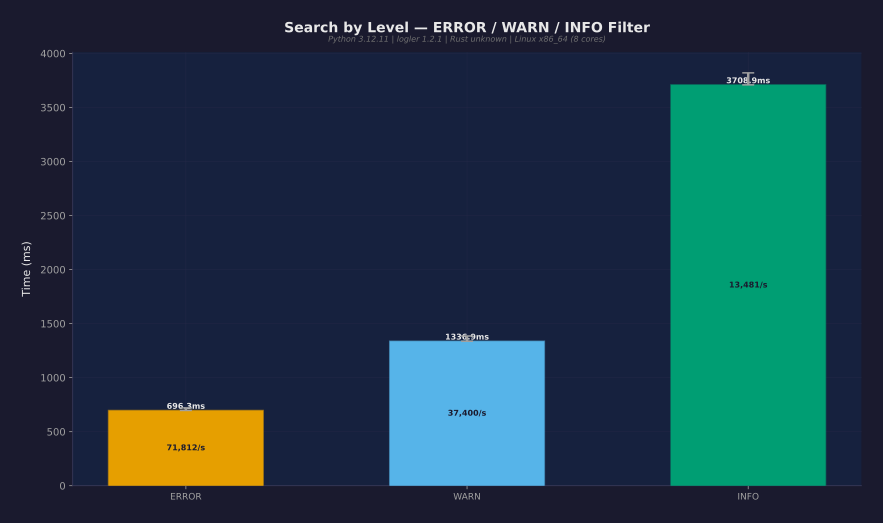

### Search Output Formats

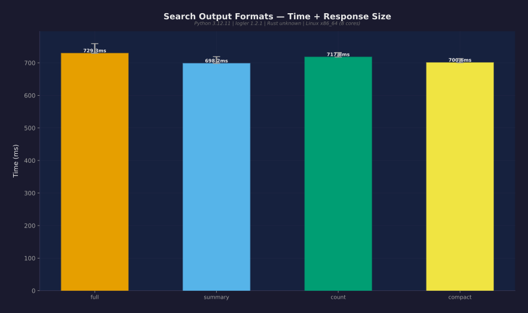

### Combined Filters

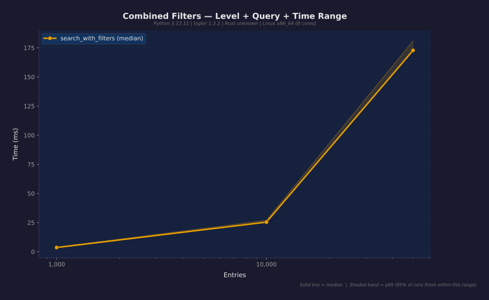

### Hierarchy Building

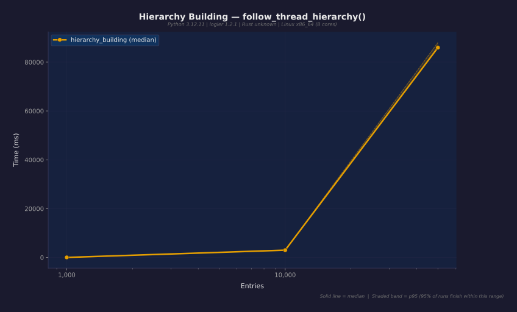

### Error Flow Analysis

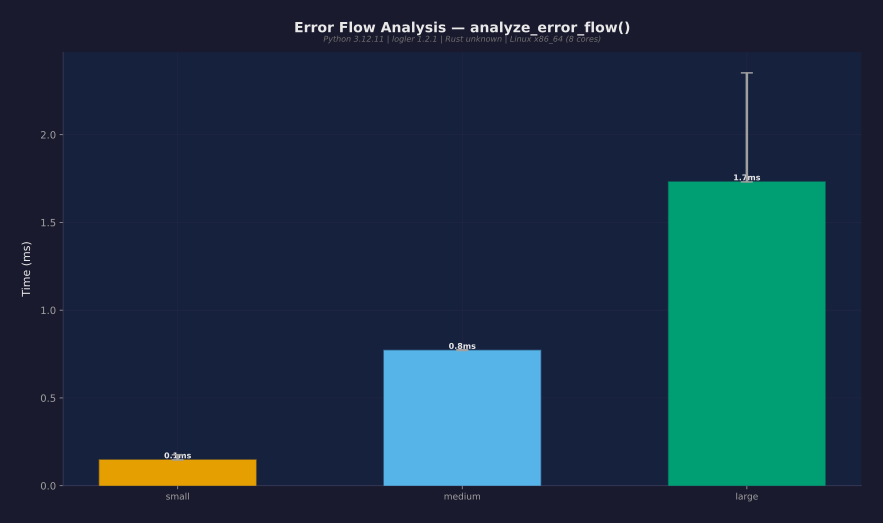

### Tree Formatting

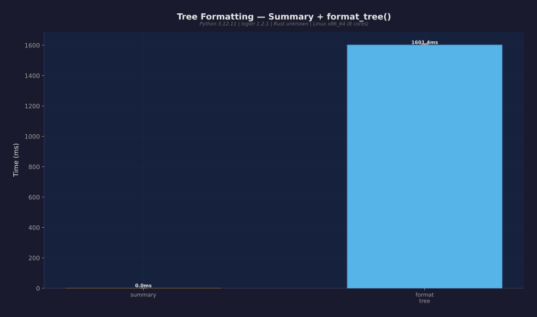

### Follow Thread Scaling

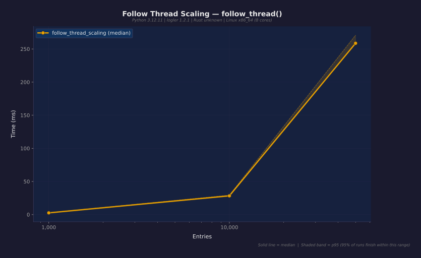

### Cross-Service Timeline

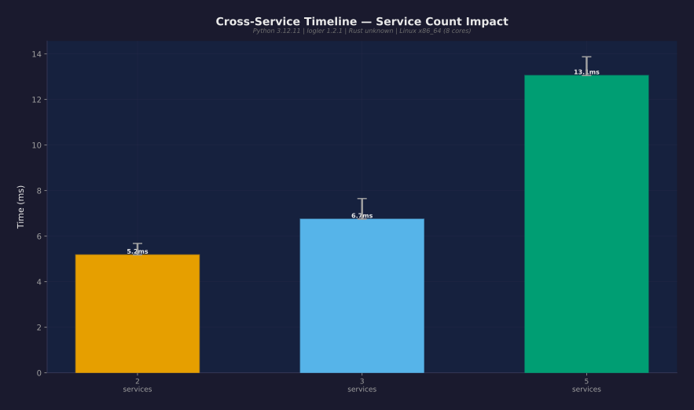

### Compare Threads

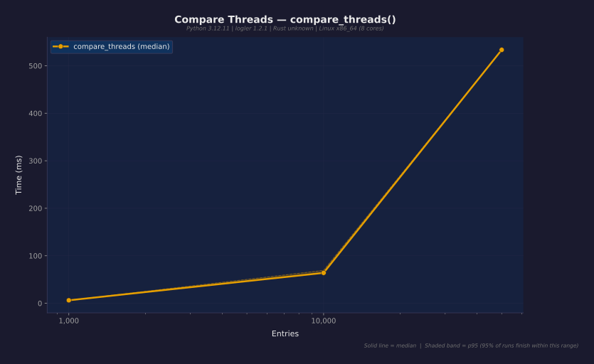

### Output Format Comparison

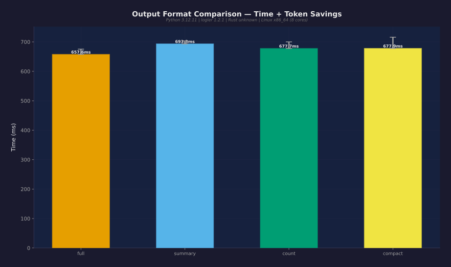

### Max-Bytes Budget

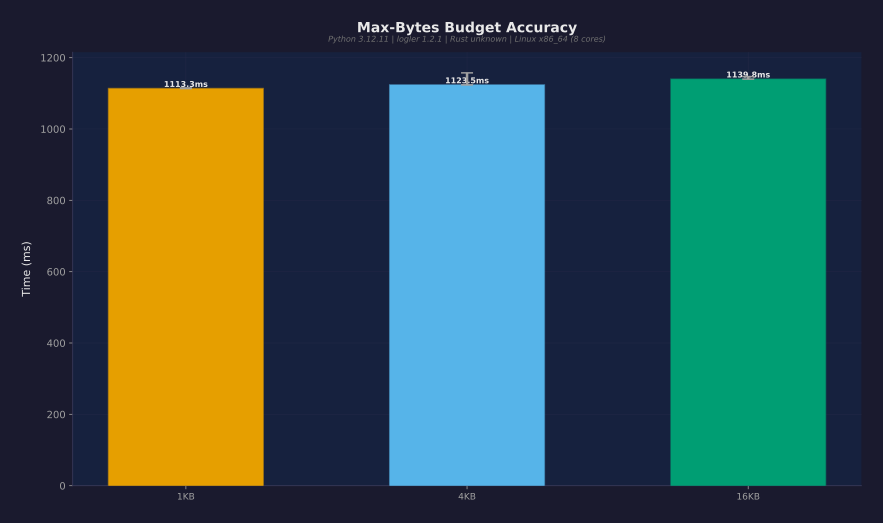

### Sampling Strategies

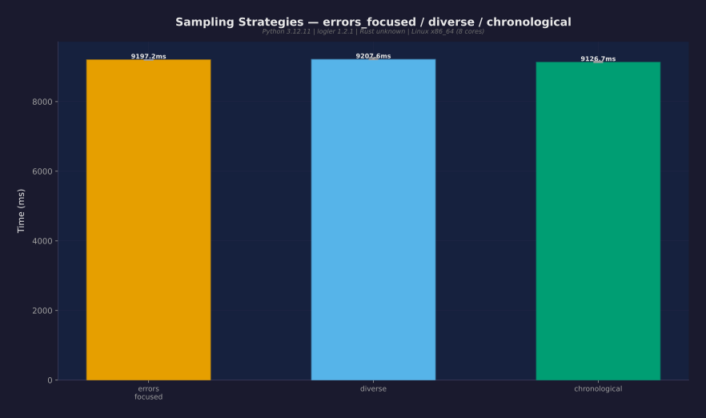

### Smart Sample Scaling

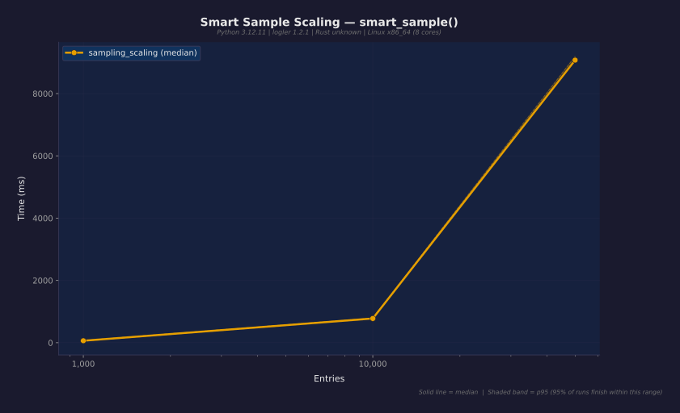

## Token Savings

Output format comparison at fixed query size:
- **full**: 513,019 bytes
- **count**: 202 bytes
- **Savings ratio**: **2540x**

## Known Gaps / Future Work

1. **Large file benchmarks** — 1GB+ file indexing and search not yet benchmarked
2. **Rust vs Python comparison** — direct comparison of Rust-backed vs pure-Python paths
3. **Memory profiling** — peak memory usage per operation not yet measured
4. **Concurrent access** — multi-threaded investigation session performance
5. **Real-world log formats** — syslog, logfmt, and mixed-format benchmarks

---

*Generated by logler benchmark suite — real data, no fiction.*
