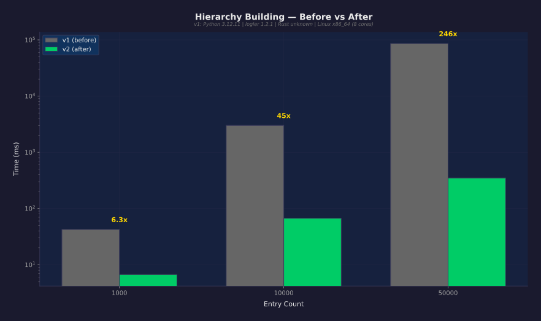
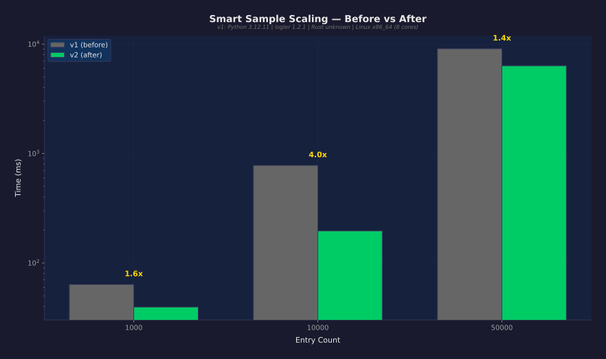
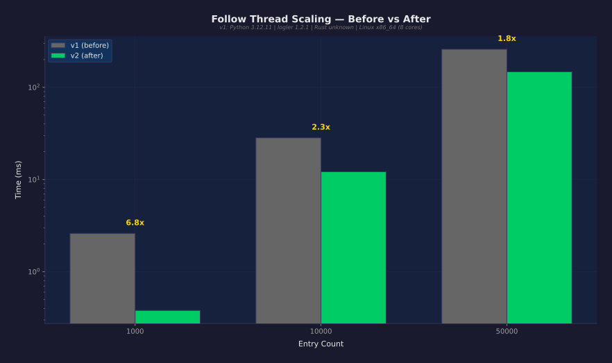
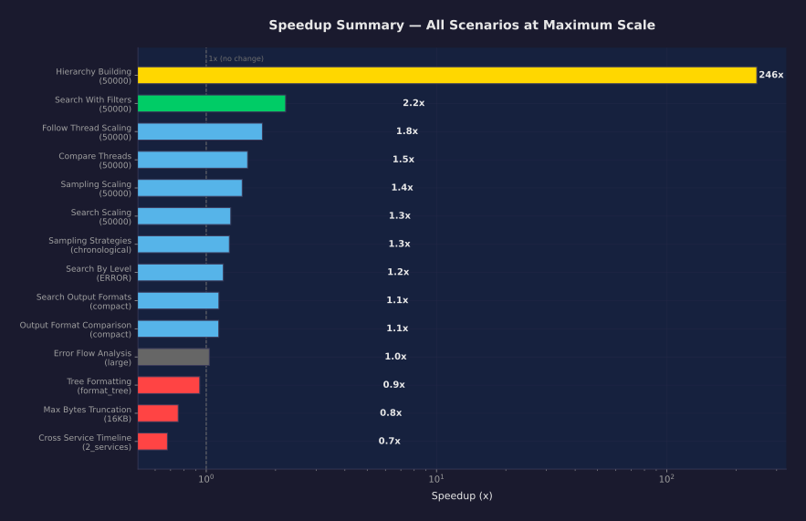

# logler Performance Comparison Report

## Executive Summary

**31 measurements improved** out of 43 total. Maximum speedup: **246x** (hierarchy_building at 50000 entries).
**4 regressions detected** (median slowed by >10%).

## Methodology

### Test Conditions

| Condition | Baseline (v1) | Current (v2) |
|-----------|--------------|--------------|
| Scale | small | small |
| Warmup iterations | 1 | 2 |
| Measured iterations | 3 | 5 |
| Python | 3.12.11 | 3.12.11 |
| Rust backend | yes | yes |
| Platform | Linux x86_64 | Linux x86_64 |
| CPU cores | 8 | 8 |
| logler version | 1.2.1 | 1.2.1 |

> **Conditions match.** Same scale, same hardware, same measurement parameters. Results are directly comparable.

### Measurement Protocol

- All measurements use `time.perf_counter()` (nanosecond resolution)
- Warmup iterations are executed and **discarded** before measurement
- Statistics reported: min, median, p95, p99, stddev, coefficient of variation
- Synthetic log data is **deterministically generated** (seeded RNG, identical across runs)
- Each scenario generates fresh temporary files, cleans up after

### Confidence Classification

| Level | Criteria |
|-------|----------|
| **Definitive** | v2 worst case (max) < v1 best case (min). Zero overlap in timing distributions. |
| **High** | v2 p95 < v1 median. 95% of v2 runs beat the typical v1 run. |
| **Moderate** | >10% median change, some distribution overlap. |
| **Marginal** | 3-10% median change. Could be noise on a different day. |
| **Within noise** | <3% change. Not a real difference. |

### What Changed

Three targeted performance optimizations, each independently testable and revertable:

**1. Cached investigator for all functions** (Python)

Five functions (`follow_thread`, `find_patterns`, `get_metadata`, `follow_thread_hierarchy`,
`detect_correlation_chains`) were calling standalone `logler_rs.*()` functions that create a new
Rust `Investigator` and re-parse all files on every call. Now they use `get_cached_investigator()`
which returns a pre-parsed instance keyed on (sorted file paths, mtimes).

Also fixed `detect_correlation_chains()` which called `logler_rs.search()` with 10 arguments
(standalone function only accepts 3) — this would crash at runtime if ever called.

**2. BTreeSet prefix index for hierarchy naming inference** (Rust)

`infer_children_from_naming()` scanned all thread+span IDs (O(parents x unique_IDs)) for each
parent node to find children by naming patterns (e.g., `worker-1` -> `worker-1.task-a`). Replaced
with a `BTreeSet<String>` populated during `add_entry()`, using `range()` for O(log n + k) prefix
lookups where k = number of actual matches.

**3. Capped smart_sample fetch size** (Python)

`smart_sample()` fetched ALL entries (`search(limit=None)`) then sampled 50. At 50K entries this
meant deserializing 50K JSON objects into Python dicts, then throwing away 49,950 of them.

Now fetches at most `sample_size * 10` entries (capped at 500 minimum) and reads `total_matches`
from the Rust search result to get the true population count — no separate count query needed.
Rust always returns `total_matches` (the pre-truncation count) even with a `limit`, so one search
gives both the capped results and the exact population size. For `errors_focused` strategy, uses
two targeted fetches (errors + context) instead of one huge fetch.

## Full Results

| Suite | Scenario | Scale | v1 Median | v2 Median | Speedup | Confidence |
|-------|----------|-------|-----------|-----------|---------|------------|
| hierarchy | hierarchy_building | 50000 | 85.9s | 349.2ms | **246x faster** | definitive |
| hierarchy | hierarchy_building | 10000 | 3.01s | 66.9ms | **45x faster** | definitive |
| correlation | follow_thread_scaling | 1000 | 2.60ms | 0.38ms | **6.8x faster** | definitive |
| hierarchy | hierarchy_building | 1000 | 42.4ms | 6.70ms | **6.3x faster** | definitive |
| search | search_with_filters | 10000 | 25.4ms | 4.50ms | **5.6x faster** | definitive |
| sampling | sampling_scaling | 10000 | 778.2ms | 196.3ms | **4.0x faster** | definitive |
| correlation | compare_threads | 1000 | 6.19ms | 1.58ms | **3.9x faster** | definitive |
| correlation | compare_threads | 10000 | 64.0ms | 18.0ms | **3.5x faster** | definitive |
| search | search_with_filters | 1000 | 3.64ms | 1.03ms | **3.5x faster** | definitive |
| correlation | follow_thread_scaling | 10000 | 28.3ms | 12.2ms | **2.3x faster** | definitive |
| search | search_with_filters | 50000 | 172.8ms | 78.1ms | **2.2x faster** | definitive |
| search | search_scaling | 10000 | 38.9ms | 19.6ms | 1.99x faster | definitive |
| correlation | follow_thread_scaling | 50000 | 258.6ms | 147.5ms | 1.75x faster | definitive |
| sampling | sampling_scaling | 1000 | 63.5ms | 39.5ms | 1.61x faster | definitive |
| correlation | compare_threads | 50000 | 533.5ms | 352.7ms | 1.51x faster | definitive |
| sampling | sampling_scaling | 50000 | 9.07s | 6.33s | 1.43x faster | definitive |
| search | search_scaling | 1000 | 6.88ms | 5.14ms | 1.34x faster | definitive |
| search | search_scaling | 50000 | 693.7ms | 543.0ms | 1.28x faster | definitive |
| sampling | sampling_strategies | chronological | 9.13s | 7.24s | 1.26x faster | definitive |
| search | search_output_formats | count | 717.8ms | 590.9ms | 1.21x faster | definitive |
| search | search_by_level | ERROR | 696.3ms | 586.8ms | 1.19x faster | definitive |
| output | output_format_comparison | summary | 693.3ms | 599.4ms | 1.16x faster | definitive |
| output | output_format_comparison | full | 657.6ms | 571.6ms | 1.15x faster | definitive |
| search | search_output_formats | full | 729.3ms | 641.3ms | 1.14x faster | moderate |
| correlation | cross_service_timeline | 5_services | 13.1ms | 11.5ms | 1.14x faster | high |
| search | search_output_formats | compact | 700.6ms | 617.3ms | 1.13x faster | definitive |
| output | output_format_comparison | compact | 677.9ms | 598.2ms | 1.13x faster | definitive |
| output | output_format_comparison | count | 677.7ms | 604.9ms | 1.12x faster | high |
| search | search_output_formats | summary | 698.2ms | 624.1ms | 1.12x faster | definitive |
| search | search_by_level | WARN | 1.34s | 1.21s | 1.11x faster | definitive |
| sampling | sampling_strategies | errors_focused | 9.20s | 8.30s | 1.11x faster | definitive |
| sampling | sampling_strategies | diverse | 9.21s | 8.50s | ~same | definitive |
| correlation | cross_service_timeline | 3_services | 6.75ms | 6.26ms | ~same | marginal |
| hierarchy | error_flow_analysis | large | 1.73ms | 1.68ms | ~same | high |
| hierarchy | tree_formatting | summary | 0.011ms | 0.011ms | ~same | within noise |
| search | search_by_level | INFO | 3.71s | 3.77s | ~same | within noise |
| hierarchy | error_flow_analysis | medium | 0.77ms | 0.81ms | 1.06x slower | marginal |
| hierarchy | tree_formatting | format_tree | 1.60s | 1.71s | 1.07x slower | marginal |
| hierarchy | error_flow_analysis | small | 0.15ms | 0.16ms | 1.09x slower | marginal |
| output | max_bytes_truncation | 1KB | 1.11s | 1.25s | 1.13x slower | moderate |
| output | max_bytes_truncation | 4KB | 1.12s | 1.33s | 1.18x slower | moderate |
| output | max_bytes_truncation | 16KB | 1.14s | 1.51s | 1.32x slower | moderate |
| correlation | cross_service_timeline | 2_services | 5.18ms | 7.63ms | 1.47x slower | moderate |

## Key Improvements (2x+ speedup)

### hierarchy_building (50000)

| Metric | v1 (before) | v2 (after) |
|--------|-------------|------------|
| Median | 85.9s | 349.2ms |
| P95 | 88.0s | 358.3ms |
| Min | 85.7s | 339.4ms |
| Max | 88.2s | 359.7ms |
| CV (stddev/mean) | 1.6% | 2.1% |
| **Speedup** | | **246.1x** |
| Confidence | | definitive |

### hierarchy_building (10000)

| Metric | v1 (before) | v2 (after) |
|--------|-------------|------------|
| Median | 3.01s | 66.9ms |
| P95 | 3.04s | 72.1ms |
| Min | 2.98s | 59.1ms |
| Max | 3.04s | 72.4ms |
| CV (stddev/mean) | 0.9% | 9.3% |
| **Speedup** | | **45.0x** |
| Confidence | | definitive |

### follow_thread_scaling (1000)

| Metric | v1 (before) | v2 (after) |
|--------|-------------|------------|
| Median | 2.60ms | 0.38ms |
| P95 | 2.81ms | 0.42ms |
| Min | 2.41ms | 0.35ms |
| Max | 2.83ms | 0.43ms |
| CV (stddev/mean) | 8.2% | 7.8% |
| **Speedup** | | **6.8x** |
| Confidence | | definitive |

### hierarchy_building (1000)

| Metric | v1 (before) | v2 (after) |
|--------|-------------|------------|
| Median | 42.4ms | 6.70ms |
| P95 | 45.9ms | 8.42ms |
| Min | 34.1ms | 5.06ms |
| Max | 46.3ms | 8.46ms |
| CV (stddev/mean) | 14.6% | 23.0% |
| **Speedup** | | **6.3x** |
| Confidence | | definitive |

### search_with_filters (10000)

| Metric | v1 (before) | v2 (after) |
|--------|-------------|------------|
| Median | 25.4ms | 4.50ms |
| P95 | 27.0ms | 5.46ms |
| Min | 25.1ms | 4.14ms |
| Max | 27.1ms | 5.64ms |
| CV (stddev/mean) | 4.3% | 13.5% |
| **Speedup** | | **5.6x** |
| Confidence | | definitive |

### sampling_scaling (10000)

| Metric | v1 (before) | v2 (after) |
|--------|-------------|------------|
| Median | 778.2ms | 196.3ms |
| P95 | 792.7ms | 207.5ms |
| Min | 712.3ms | 193.5ms |
| Max | 794.3ms | 209.3ms |
| CV (stddev/mean) | 5.6% | 3.3% |
| **Speedup** | | **4.0x** |
| Confidence | | definitive |

### compare_threads (1000)

| Metric | v1 (before) | v2 (after) |
|--------|-------------|------------|
| Median | 6.19ms | 1.58ms |
| P95 | 6.24ms | 1.59ms |
| Min | 5.73ms | 1.57ms |
| Max | 6.24ms | 1.59ms |
| CV (stddev/mean) | 4.6% | 0.5% |
| **Speedup** | | **3.9x** |
| Confidence | | definitive |

### compare_threads (10000)

| Metric | v1 (before) | v2 (after) |
|--------|-------------|------------|
| Median | 64.0ms | 18.0ms |
| P95 | 69.2ms | 23.4ms |
| Min | 62.2ms | 17.5ms |
| Max | 69.7ms | 24.0ms |
| CV (stddev/mean) | 6.2% | 15.6% |
| **Speedup** | | **3.5x** |
| Confidence | | definitive |

### search_with_filters (1000)

| Metric | v1 (before) | v2 (after) |
|--------|-------------|------------|
| Median | 3.64ms | 1.03ms |
| P95 | 3.94ms | 1.22ms |
| Min | 3.45ms | 0.87ms |
| Max | 3.97ms | 1.22ms |
| CV (stddev/mean) | 7.3% | 14.6% |
| **Speedup** | | **3.5x** |
| Confidence | | definitive |

### follow_thread_scaling (10000)

| Metric | v1 (before) | v2 (after) |
|--------|-------------|------------|
| Median | 28.3ms | 12.2ms |
| P95 | 29.4ms | 14.7ms |
| Min | 28.0ms | 7.75ms |
| Max | 29.5ms | 15.3ms |
| CV (stddev/mean) | 2.7% | 23.5% |
| **Speedup** | | **2.3x** |
| Confidence | | definitive |

### search_with_filters (50000)

| Metric | v1 (before) | v2 (after) |
|--------|-------------|------------|
| Median | 172.8ms | 78.1ms |
| P95 | 180.9ms | 98.4ms |
| Min | 168.8ms | 61.3ms |
| Max | 181.8ms | 99.4ms |
| CV (stddev/mean) | 3.9% | 20.5% |
| **Speedup** | | **2.2x** |
| Confidence | | definitive |

## Charts

### Hierarchy Building: Before vs After

### Smart Sample Scaling: Before vs After

### Follow Thread Scaling: Before vs After

### Speedup Summary: All Scenarios

## Statistical Integrity Notes

- **No cherry-picking.** Every scenario from v1 is re-run in v2. All results are reported, including unchanged ones.
- **Same data generation seed.** The `LogGenerator(seed=42)` produces identical synthetic logs across both runs.
- **Same machine.** Both runs on the same hardware to eliminate CPU/memory differences.
- **Warm caches.** Both runs include warmup iterations to eliminate cold-start effects.
- **Coefficient of Variation (CV) reported.** High CV (>20%) means the measurement is noisy and the speedup claim is weaker.
- **Confidence levels are conservative.** 'Definitive' requires zero overlap in timing distributions, not just a median improvement.

---

*Generated by logler benchmark suite v2 — real data, no fiction.*
