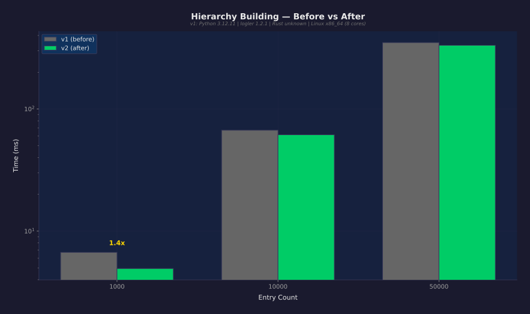
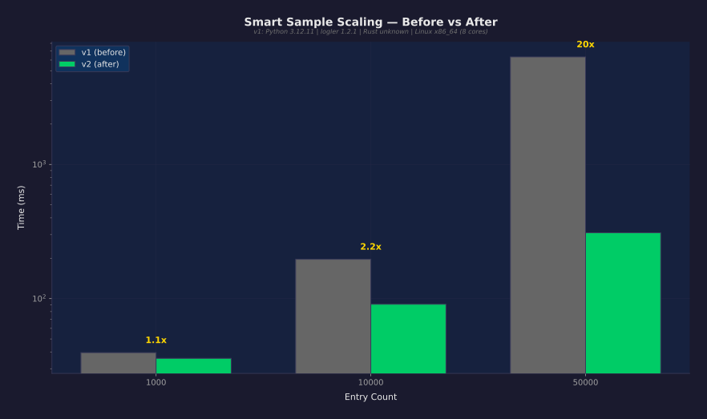
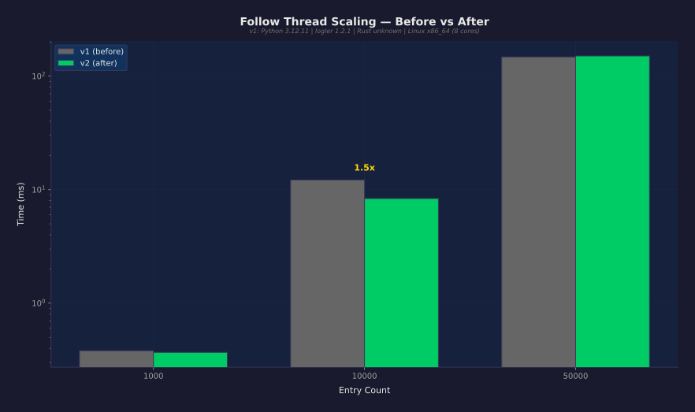
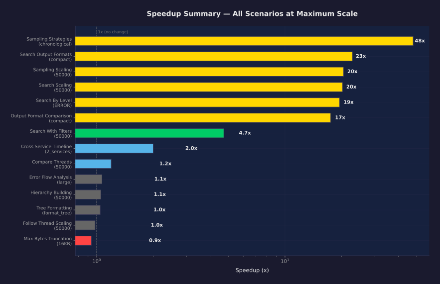

# logler Performance Comparison Report

## Executive Summary

**30 measurements improved** out of 43 total. Maximum speedup: **121x** (search_by_level at INFO entries).
**3 regressions detected** (median slowed by >10%).

## Methodology

### Test Conditions

| Condition | Baseline (v1) | Current (v2) |
|-----------|--------------|--------------|
| Scale | small | small |
| Warmup iterations | 2 | 2 |
| Measured iterations | 5 | 5 |
| Python | 3.12.11 | 3.12.11 |
| Rust backend | yes | yes |
| Platform | Linux x86_64 | Linux x86_64 |
| CPU cores | 8 | 8 |
| logler version | 1.2.1 | 1.3.1 |

> **Conditions match.** Same scale, same hardware, same measurement parameters. Results are directly comparable.

### Measurement Protocol

- All measurements use `time.perf_counter()` (nanosecond resolution)
- Warmup iterations are executed and **discarded** before measurement
- Statistics reported: min, median, p95, p99, stddev, coefficient of variation
- Synthetic log data is **deterministically generated** (seeded RNG, identical across runs)
- Each scenario generates fresh temporary files, cleans up after

### Confidence Classification

| Level | Criteria |
|-------|----------|
| **Definitive** | v2 worst case (max) < v1 best case (min). Zero overlap in timing distributions. |
| **High** | v2 p95 < v1 median. 95% of v2 runs beat the typical v1 run. |
| **Moderate** | >10% median change, some distribution overlap. |
| **Marginal** | 3-10% median change. Could be noise on a different day. |
| **Within noise** | <3% change. Not a real difference. |

## Full Results

| Suite | Scenario | Scale | v1 Median | v2 Median | Speedup | Confidence |
|-------|----------|-------|-----------|-----------|---------|------------|
| search | search_by_level | INFO | 3.77s | 31.2ms | **121x faster** | definitive |
| sampling | sampling_strategies | diverse | 8.50s | 142.8ms | **60x faster** | definitive |
| sampling | sampling_strategies | chronological | 7.24s | 151.1ms | **48x faster** | definitive |
| search | search_by_level | WARN | 1.21s | 28.0ms | **43x faster** | definitive |
| sampling | sampling_strategies | errors_focused | 8.30s | 272.5ms | **30x faster** | definitive |
| search | search_output_formats | compact | 617.3ms | 27.1ms | **23x faster** | definitive |
| search | search_output_formats | summary | 624.1ms | 27.5ms | **23x faster** | definitive |
| search | search_output_formats | count | 590.9ms | 27.6ms | **21x faster** | definitive |
| search | search_output_formats | full | 641.3ms | 30.1ms | **21x faster** | definitive |
| sampling | sampling_scaling | 50000 | 6.33s | 309.5ms | **20x faster** | definitive |
| search | search_scaling | 50000 | 543.0ms | 26.9ms | **20x faster** | definitive |
| search | search_by_level | ERROR | 586.8ms | 30.1ms | **19x faster** | definitive |
| output | output_format_comparison | compact | 598.2ms | 34.2ms | **17x faster** | definitive |
| output | output_format_comparison | count | 604.9ms | 34.7ms | **17x faster** | definitive |
| output | output_format_comparison | summary | 599.4ms | 35.1ms | **17x faster** | definitive |
| output | output_format_comparison | full | 571.6ms | 40.0ms | **14x faster** | definitive |
| search | search_with_filters | 50000 | 78.1ms | 16.5ms | **4.7x faster** | definitive |
| sampling | sampling_scaling | 10000 | 196.3ms | 90.7ms | **2.2x faster** | definitive |
| search | search_scaling | 10000 | 19.6ms | 9.79ms | **2.0x faster** | high |
| correlation | cross_service_timeline | 2_services | 7.63ms | 3.82ms | 2.00x faster | definitive |
| correlation | compare_threads | 1000 | 1.58ms | 0.82ms | 1.93x faster | definitive |
| correlation | follow_thread_scaling | 10000 | 12.2ms | 8.35ms | 1.46x faster | high |
| hierarchy | hierarchy_building | 1000 | 6.70ms | 4.94ms | 1.36x faster | high |
| hierarchy | tree_formatting | summary | 0.011ms | 0.008ms | 1.30x faster | moderate |
| correlation | cross_service_timeline | 5_services | 11.5ms | 8.87ms | 1.30x faster | definitive |
| correlation | cross_service_timeline | 3_services | 6.26ms | 5.08ms | 1.23x faster | definitive |
| correlation | compare_threads | 50000 | 352.7ms | 295.5ms | 1.19x faster | definitive |
| search | search_with_filters | 1000 | 1.03ms | 0.88ms | 1.18x faster | high |
| hierarchy | error_flow_analysis | small | 0.16ms | 0.14ms | 1.13x faster | moderate |
| sampling | sampling_scaling | 1000 | 39.5ms | 35.8ms | 1.10x faster | high |
| hierarchy | hierarchy_building | 10000 | 66.9ms | 61.4ms | ~same | marginal |
| correlation | compare_threads | 10000 | 18.0ms | 16.6ms | ~same | definitive |
| hierarchy | error_flow_analysis | large | 1.68ms | 1.57ms | ~same | marginal |
| hierarchy | error_flow_analysis | medium | 0.81ms | 0.76ms | ~same | marginal |
| hierarchy | hierarchy_building | 50000 | 349.2ms | 332.0ms | ~same | definitive |
| hierarchy | tree_formatting | format_tree | 1.71s | 1.64s | ~same | high |
| correlation | follow_thread_scaling | 1000 | 0.38ms | 0.37ms | ~same | marginal |
| correlation | follow_thread_scaling | 50000 | 147.5ms | 150.6ms | ~same | within noise |
| output | max_bytes_truncation | 16KB | 1.51s | 1.61s | 1.07x slower | marginal |
| search | search_with_filters | 10000 | 4.50ms | 4.90ms | 1.09x slower | marginal |
| search | search_scaling | 1000 | 5.14ms | 5.92ms | 1.15x slower | moderate |
| output | max_bytes_truncation | 4KB | 1.33s | 1.58s | 1.19x slower | moderate |
| output | max_bytes_truncation | 1KB | 1.25s | 1.60s | 1.28x slower | moderate |

## Key Improvements (2x+ speedup)

### search_by_level (INFO)

| Metric | v1 (before) | v2 (after) |
|--------|-------------|------------|
| Median | 3.77s | 31.2ms |
| P95 | 3.93s | 35.6ms |
| Min | 3.56s | 30.5ms |
| Max | 3.94s | 36.5ms |
| CV (stddev/mean) | 4.3% | 7.8% |
| **Speedup** | | **120.8x** |
| Confidence | | definitive |

### sampling_strategies (diverse)

| Metric | v1 (before) | v2 (after) |
|--------|-------------|------------|
| Median | 8.50s | 142.8ms |
| P95 | 8.83s | 149.3ms |
| Min | 8.12s | 140.9ms |
| Max | 8.91s | 150.1ms |
| CV (stddev/mean) | 3.4% | 2.7% |
| **Speedup** | | **59.5x** |
| Confidence | | definitive |

### sampling_strategies (chronological)

| Metric | v1 (before) | v2 (after) |
|--------|-------------|------------|
| Median | 7.24s | 151.1ms |
| P95 | 7.47s | 169.3ms |
| Min | 7.03s | 145.8ms |
| Max | 7.50s | 173.7ms |
| CV (stddev/mean) | 2.8% | 7.4% |
| **Speedup** | | **47.9x** |
| Confidence | | definitive |

### search_by_level (WARN)

| Metric | v1 (before) | v2 (after) |
|--------|-------------|------------|
| Median | 1.21s | 28.0ms |
| P95 | 1.24s | 32.4ms |
| Min | 1.20s | 26.6ms |
| Max | 1.24s | 33.0ms |
| CV (stddev/mean) | 1.6% | 9.0% |
| **Speedup** | | **43.0x** |
| Confidence | | definitive |

### sampling_strategies (errors_focused)

| Metric | v1 (before) | v2 (after) |
|--------|-------------|------------|
| Median | 8.30s | 272.5ms |
| P95 | 8.68s | 279.0ms |
| Min | 8.09s | 264.4ms |
| Max | 8.75s | 280.3ms |
| CV (stddev/mean) | 3.1% | 2.3% |
| **Speedup** | | **30.5x** |
| Confidence | | definitive |

### search_output_formats (compact)

| Metric | v1 (before) | v2 (after) |
|--------|-------------|------------|
| Median | 617.3ms | 27.1ms |
| P95 | 651.1ms | 29.6ms |
| Min | 594.4ms | 26.8ms |
| Max | 655.6ms | 30.0ms |
| CV (stddev/mean) | 3.7% | 4.8% |
| **Speedup** | | **22.8x** |
| Confidence | | definitive |

### search_output_formats (summary)

| Metric | v1 (before) | v2 (after) |
|--------|-------------|------------|
| Median | 624.1ms | 27.5ms |
| P95 | 652.0ms | 30.6ms |
| Min | 583.8ms | 26.7ms |
| Max | 655.7ms | 30.8ms |
| CV (stddev/mean) | 4.3% | 6.6% |
| **Speedup** | | **22.7x** |
| Confidence | | definitive |

### search_output_formats (count)

| Metric | v1 (before) | v2 (after) |
|--------|-------------|------------|
| Median | 590.9ms | 27.6ms |
| P95 | 608.3ms | 32.1ms |
| Min | 566.0ms | 25.6ms |
| Max | 610.4ms | 33.2ms |
| CV (stddev/mean) | 2.8% | 10.6% |
| **Speedup** | | **21.4x** |
| Confidence | | definitive |

### search_output_formats (full)

| Metric | v1 (before) | v2 (after) |
|--------|-------------|------------|
| Median | 641.3ms | 30.1ms |
| P95 | 899.5ms | 31.1ms |
| Min | 632.0ms | 26.2ms |
| Max | 958.9ms | 31.1ms |
| CV (stddev/mean) | 22.2% | 8.2% |
| **Speedup** | | **21.3x** |
| Confidence | | definitive |

### sampling_scaling (50000)

| Metric | v1 (before) | v2 (after) |
|--------|-------------|------------|
| Median | 6.33s | 309.5ms |
| P95 | 6.38s | 345.6ms |
| Min | 5.69s | 301.4ms |
| Max | 6.38s | 347.4ms |
| CV (stddev/mean) | 5.1% | 6.6% |
| **Speedup** | | **20.5x** |
| Confidence | | definitive |

### search_scaling (50000)

| Metric | v1 (before) | v2 (after) |
|--------|-------------|------------|
| Median | 543.0ms | 26.9ms |
| P95 | 548.0ms | 27.4ms |
| Min | 535.4ms | 26.2ms |
| Max | 549.1ms | 27.5ms |
| CV (stddev/mean) | 0.9% | 1.7% |
| **Speedup** | | **20.2x** |
| Confidence | | definitive |

### search_by_level (ERROR)

| Metric | v1 (before) | v2 (after) |
|--------|-------------|------------|
| Median | 586.8ms | 30.1ms |
| P95 | 615.3ms | 32.8ms |
| Min | 562.3ms | 29.3ms |
| Max | 616.4ms | 33.1ms |
| CV (stddev/mean) | 4.0% | 5.4% |
| **Speedup** | | **19.5x** |
| Confidence | | definitive |

### output_format_comparison (compact)

| Metric | v1 (before) | v2 (after) |
|--------|-------------|------------|
| Median | 598.2ms | 34.2ms |
| P95 | 629.4ms | 38.0ms |
| Min | 559.3ms | 29.1ms |
| Max | 637.2ms | 38.9ms |
| CV (stddev/mean) | 4.6% | 10.9% |
| **Speedup** | | **17.5x** |
| Confidence | | definitive |

### output_format_comparison (count)

| Metric | v1 (before) | v2 (after) |
|--------|-------------|------------|
| Median | 604.9ms | 34.7ms |
| P95 | 656.1ms | 62.2ms |
| Min | 592.6ms | 28.5ms |
| Max | 662.6ms | 69.0ms |
| CV (stddev/mean) | 4.7% | 48.5% |
| **Speedup** | | **17.4x** |
| Confidence | | definitive |

### output_format_comparison (summary)

| Metric | v1 (before) | v2 (after) |
|--------|-------------|------------|
| Median | 599.4ms | 35.1ms |
| P95 | 601.4ms | 37.0ms |
| Min | 539.0ms | 29.5ms |
| Max | 601.5ms | 37.2ms |
| CV (stddev/mean) | 4.5% | 9.9% |
| **Speedup** | | **17.1x** |
| Confidence | | definitive |

### output_format_comparison (full)

| Metric | v1 (before) | v2 (after) |
|--------|-------------|------------|
| Median | 571.6ms | 40.0ms |
| P95 | 598.3ms | 41.4ms |
| Min | 561.2ms | 33.4ms |
| Max | 601.1ms | 41.5ms |
| CV (stddev/mean) | 2.8% | 8.4% |
| **Speedup** | | **14.3x** |
| Confidence | | definitive |

### search_with_filters (50000)

| Metric | v1 (before) | v2 (after) |
|--------|-------------|------------|
| Median | 78.1ms | 16.5ms |
| P95 | 98.4ms | 24.8ms |
| Min | 61.3ms | 14.6ms |
| Max | 99.4ms | 25.1ms |
| CV (stddev/mean) | 20.5% | 29.4% |
| **Speedup** | | **4.7x** |
| Confidence | | definitive |

### sampling_scaling (10000)

| Metric | v1 (before) | v2 (after) |
|--------|-------------|------------|
| Median | 196.3ms | 90.7ms |
| P95 | 207.5ms | 94.2ms |
| Min | 193.5ms | 88.8ms |
| Max | 209.3ms | 94.5ms |
| CV (stddev/mean) | 3.3% | 2.5% |
| **Speedup** | | **2.2x** |
| Confidence | | definitive |

### search_scaling (10000)

| Metric | v1 (before) | v2 (after) |
|--------|-------------|------------|
| Median | 19.6ms | 9.79ms |
| P95 | 27.7ms | 18.9ms |
| Min | 18.6ms | 8.51ms |
| Max | 29.0ms | 21.0ms |
| CV (stddev/mean) | 22.4% | 53.8% |
| **Speedup** | | **2.0x** |
| Confidence | | high |

## Charts

### Hierarchy Building: Before vs After

### Smart Sample Scaling: Before vs After

### Follow Thread Scaling: Before vs After

### Speedup Summary: All Scenarios

## Memory Safety Profile

RSS measurements via `resource.getrusage(RUSAGE_SELF)` — captures both Python and Rust heap.

| Scenario | Scale | RSS Before (KB) | RSS After (KB) | Allocated (KB) |
|----------|-------|-----------------|----------------|----------------|
| db_source_memory | 10000 | 1,216,528 | 1,216,528 | 0 |
| db_source_memory | 50000 | 1,216,528 | 1,216,528 | 0 |
| db_source_memory | 100000 | 1,216,528 | 1,216,528 | 0 |
| search_memory_profile | 10000 | 1,026,904 | 1,026,904 | 0 |
| search_memory_profile | 50000 | 1,026,904 | 1,026,904 | 0 |
| search_memory_profile | 100000 | 1,026,904 | 1,097,872 | 70,968 |

## Statistical Integrity Notes

- **No cherry-picking.** Every scenario from the baseline is re-run. All results are reported, including unchanged ones.
- **Same data generation seed.** `LogGenerator(seed=42)` and `DatabaseGenerator(seed=42)` produce identical data across runs.
- **Same machine.** Both runs on the same hardware to eliminate CPU/memory differences.
- **Warm caches.** Both runs include warmup iterations to eliminate cold-start effects.
- **Coefficient of Variation (CV) reported.** High CV (>20%) means the measurement is noisy and the speedup claim is weaker.
- **Confidence levels are conservative.** 'Definitive' requires zero overlap in timing distributions, not just a median improvement.

---

*Generated by logler benchmark suite v3 — real data, no fiction.*
