# logler Benchmark Report

**Scale**: small | **Scenarios**: 19 | **Measurements**: 58

> Python 3.12.11 | logler 1.3.1 | Rust unknown | Linux x86_64 (8 cores)

## Summary

| Suite | Scenario | Parameter | Median (ms) | P95 (ms) | Throughput |
|-------|----------|-----------|-------------|----------|------------|
| search | search_scaling | 1000 | 5.62 | 5.93 | 178,028/s |
| search | search_scaling | 10000 | 8.93 | 10.28 | 1,119,532/s |
| search | search_scaling | 50000 | 39.52 | 43.97 | 1,265,317/s |
| search | search_by_level | ERROR | 37.63 | 42.74 | 1,328,702/s |
| search | search_by_level | WARN | 34.70 | 43.06 | 1,440,789/s |
| search | search_by_level | INFO | 36.93 | 45.19 | 1,353,832/s |
| search | search_output_formats | full | 39.40 | 39.83 | — |
| search | search_output_formats | summary | 36.16 | 39.27 | — |
| search | search_output_formats | count | 34.82 | 35.28 | — |
| search | search_output_formats | compact | 32.54 | 40.33 | — |
| search | search_with_filters | 1000 | 0.90 | 1.56 | 1,112,100/s |
| search | search_with_filters | 10000 | 7.53 | 7.80 | 1,328,339/s |
| search | search_with_filters | 50000 | 19.31 | 25.11 | 2,589,801/s |
| hierarchy | hierarchy_building | 1000 | 5.05 | 5.20 | — |
| hierarchy | hierarchy_building | 10000 | 57.71 | 61.56 | — |
| hierarchy | hierarchy_building | 50000 | 355.39 | 366.02 | — |
| hierarchy | error_flow_analysis | small | 0.14 | 0.15 | — |
| hierarchy | error_flow_analysis | medium | 0.81 | 1.06 | — |
| hierarchy | error_flow_analysis | large | 2.25 | 3.06 | — |
| hierarchy | tree_formatting | summary | 0.01 | 0.01 | — |
| hierarchy | tree_formatting | format_tree | 1602.14 | 1690.74 | — |
| correlation | follow_thread_scaling | 1000 | 0.36 | 0.41 | 2,762,431/s |
| correlation | follow_thread_scaling | 10000 | 7.96 | 8.96 | 1,256,281/s |
| correlation | follow_thread_scaling | 50000 | 144.72 | 147.38 | 345,501/s |
| correlation | cross_service_timeline | 2_services | 3.27 | 3.34 | — |
| correlation | cross_service_timeline | 3_services | 5.53 | 6.16 | — |
| correlation | cross_service_timeline | 5_services | 10.57 | 12.46 | — |
| correlation | compare_threads | 1000 | 0.85 | 0.98 | — |
| correlation | compare_threads | 10000 | 16.64 | 18.32 | — |
| correlation | compare_threads | 50000 | 285.39 | 288.17 | — |
| output | output_format_comparison | full | 49.18 | 89.73 | — |
| output | output_format_comparison | summary | 56.42 | 70.81 | — |
| output | output_format_comparison | count | 68.65 | 97.29 | — |
| output | output_format_comparison | compact | 51.88 | 70.86 | — |
| output | max_bytes_truncation | 1KB | 1828.52 | 2202.17 | — |
| output | max_bytes_truncation | 4KB | 2223.63 | 3504.97 | — |
| output | max_bytes_truncation | 16KB | 1823.26 | 2316.78 | — |
| sampling | sampling_strategies | errors_focused | 352.88 | 430.95 | — |
| sampling | sampling_strategies | diverse | 165.71 | 183.15 | — |
| sampling | sampling_strategies | chronological | 175.46 | 227.16 | — |
| sampling | sampling_scaling | 1000 | 66.74 | 69.37 | 14,984/s |
| sampling | sampling_scaling | 10000 | 156.56 | 207.32 | 63,872/s |
| sampling | sampling_scaling | 50000 | 621.53 | 642.37 | 80,447/s |
| memory | search_broad_query | 10000 | 11.53 | 16.33 | 867,528/s |
| memory | search_broad_query | 50000 | 51.29 | 64.19 | 974,900/s |
| memory | search_broad_query | 100000 | 137.15 | 161.44 | 729,107/s |
| memory | search_memory_profile | 10000 | 25.98 | 25.98 | — |
| memory | search_memory_profile | 50000 | 70.53 | 70.53 | — |
| memory | search_memory_profile | 100000 | 141.53 | 141.53 | — |
| db_source | db_to_jsonl_scaling | 1000 | 24.82 | 39.69 | 40,291/s |
| db_source | db_to_jsonl_scaling | 10000 | 256.06 | 274.86 | 39,054/s |
| db_source | db_to_jsonl_scaling | 50000 | 1529.58 | 1679.03 | 32,689/s |
| db_source | db_source_search | 1000 | 52.32 | 55.89 | 19,113/s |
| db_source | db_source_search | 10000 | 457.50 | 538.52 | 21,858/s |
| db_source | db_source_search | 50000 | 4622.58 | 5386.42 | 10,816/s |
| db_source | db_source_memory | 10000 | 1214.32 | 1214.32 | — |
| db_source | db_source_memory | 50000 | 21318.60 | 21318.60 | — |
| db_source | db_source_memory | 100000 | 21448.90 | 21448.90 | — |

## Reading the Charts

Every benchmark runs multiple iterations. The numbers you see are:

- **Median** — the middle value across all iterations. Half the runs were faster, half were slower. More stable than the mean because a single slow run doesn't skew it.
- **P95 (95th percentile)** — 95% of runs finished at or below this time. This is your realistic worst-case.
- **Shaded bands** (on scaling line charts) — the area between median and p95. A narrow band means the operation is predictable. A wide band means variance is high.
- **Error caps** (on bar charts) — the vertical whisker above each bar extends to p95.

## Charts

### Search Scaling

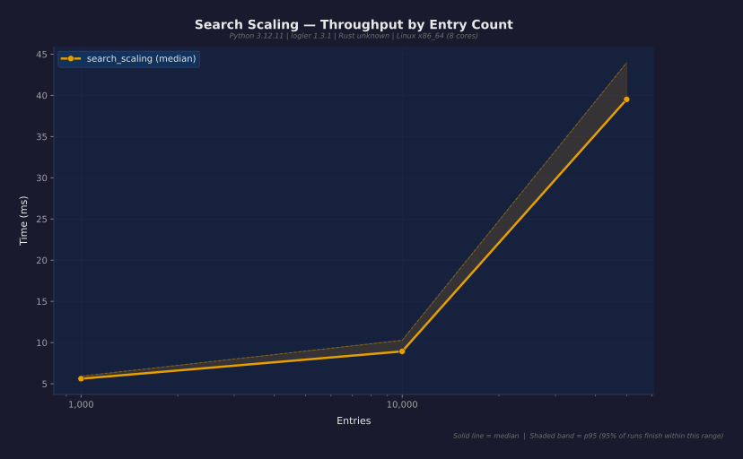

### Search by Level

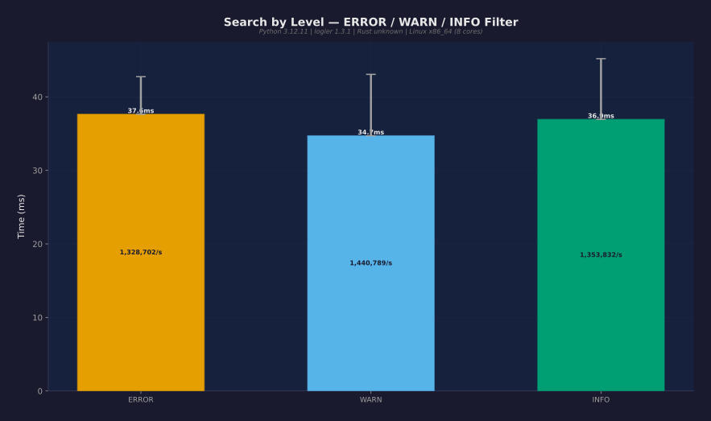

### Search Output Formats

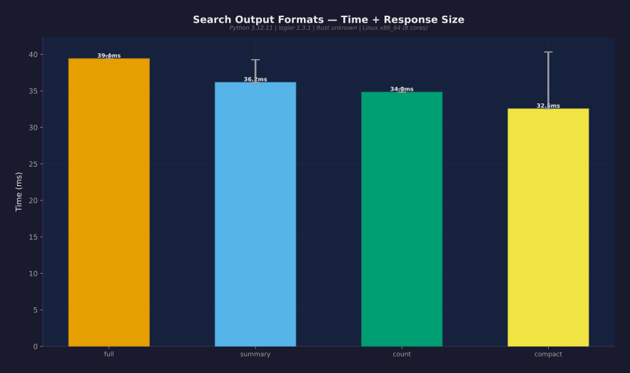

### Combined Filters

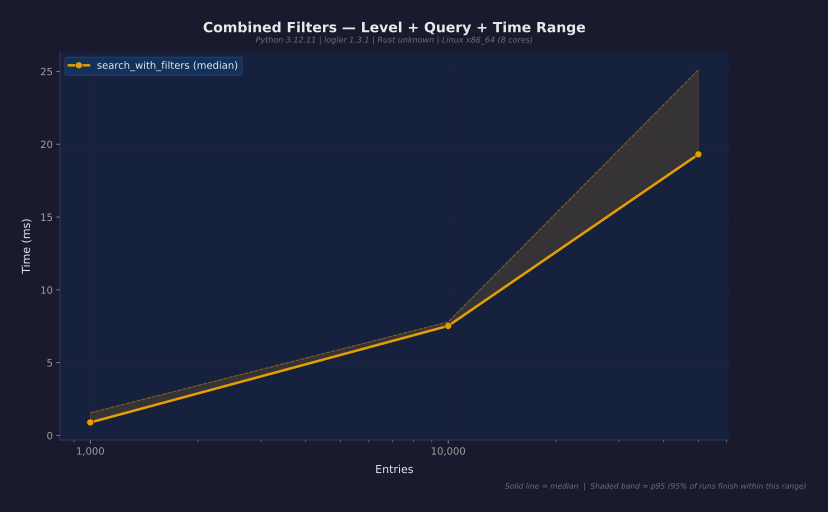

### Hierarchy Building

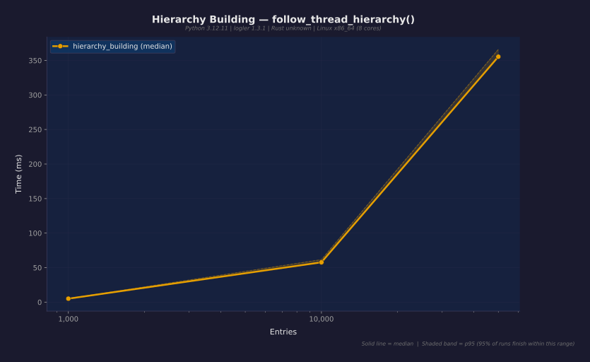

### Error Flow Analysis

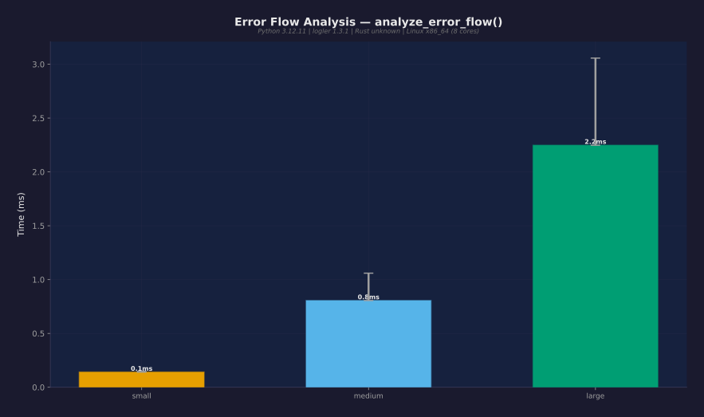

### Tree Formatting

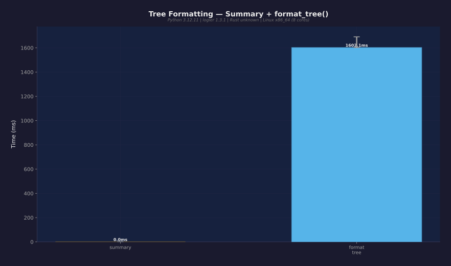

### Follow Thread Scaling

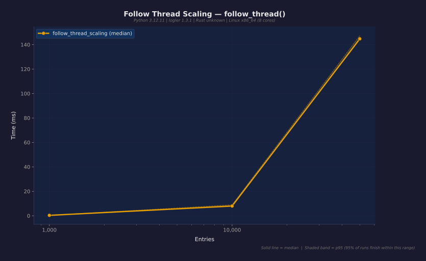

### Cross-Service Timeline

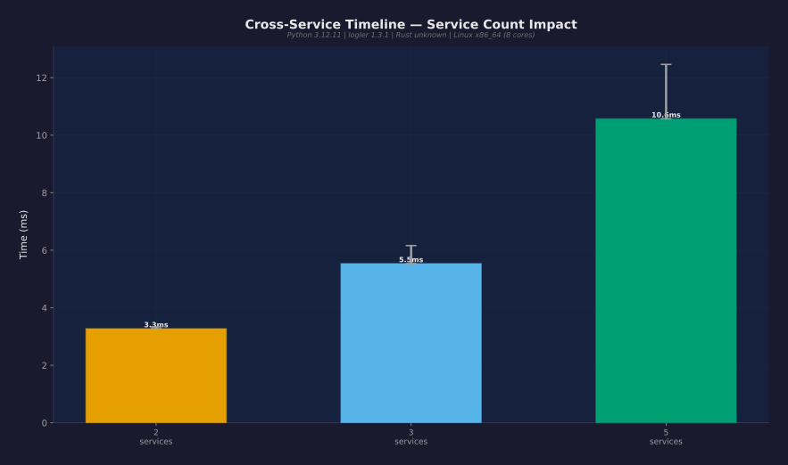

### Compare Threads

### Output Format Comparison

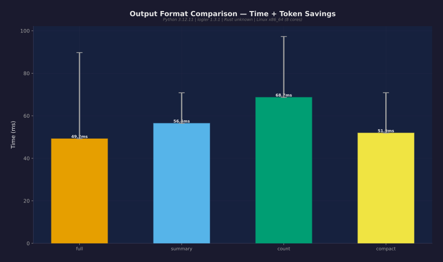

### Max-Bytes Budget

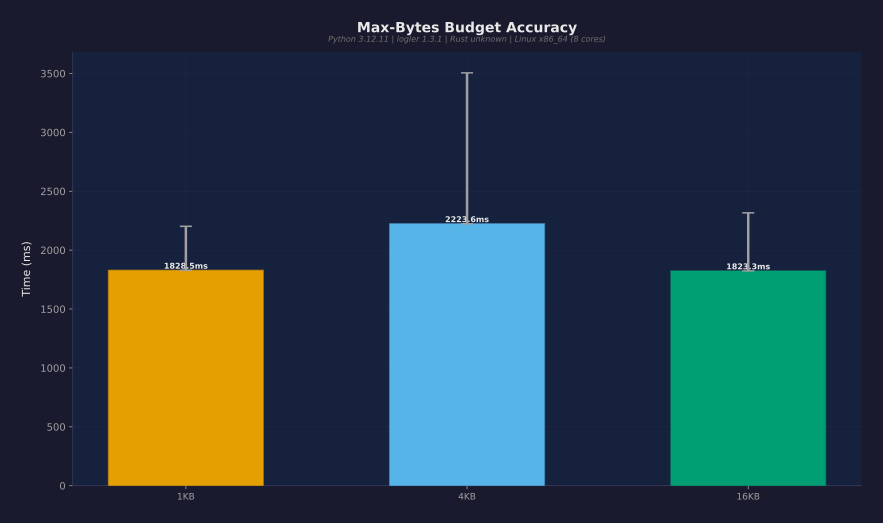

### Sampling Strategies

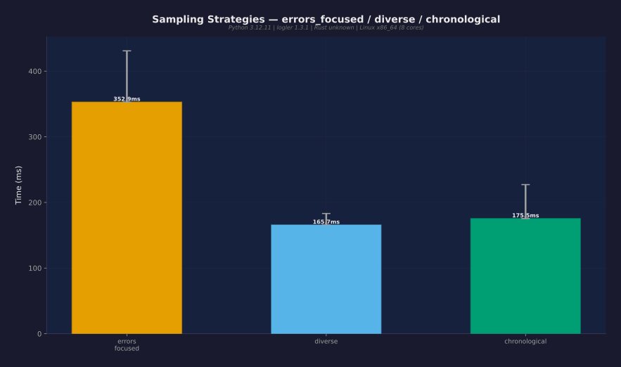

### Smart Sample Scaling

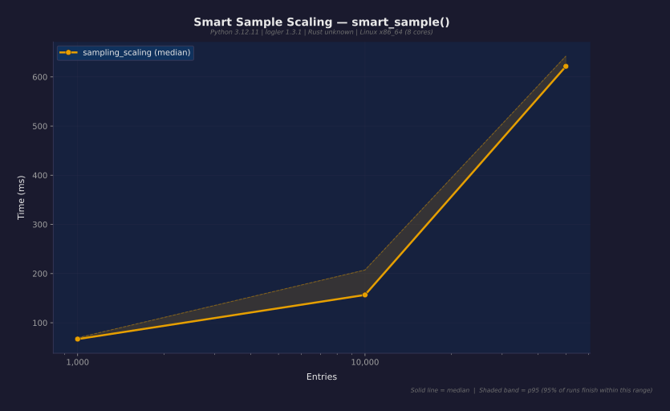

### Broad Query Search

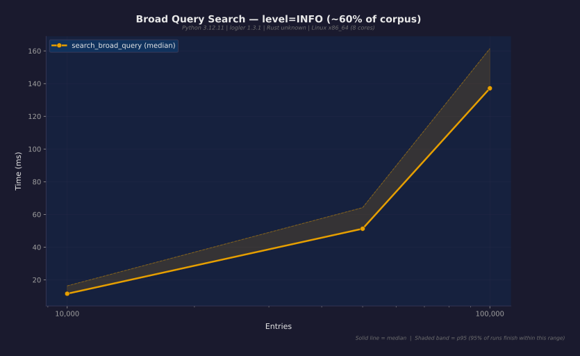

### Search Memory Profile

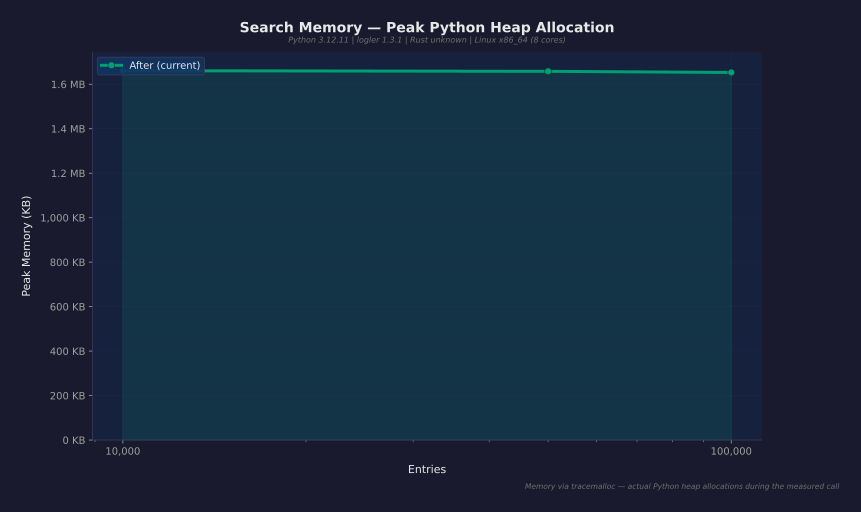

### DB to JSONL Streaming

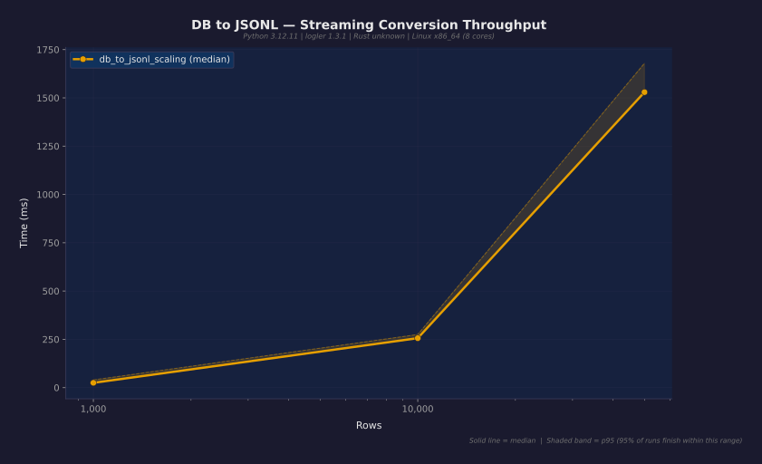

### DB Source Search

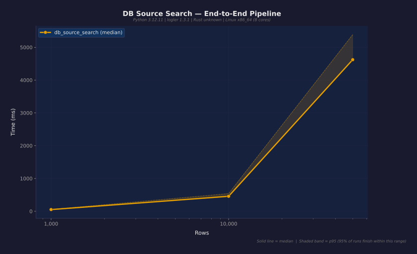

### DB Source Memory Profile

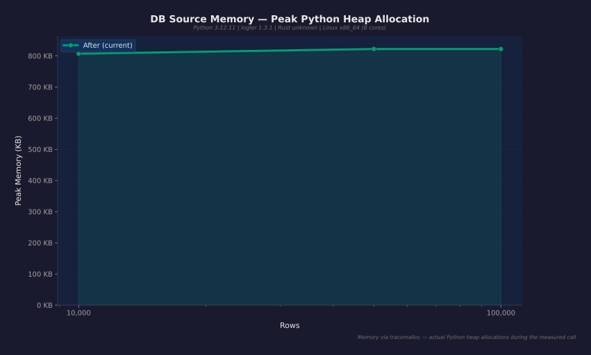

## Token Savings

Output format comparison at fixed query size:
- **full**: 513,018 bytes
- **count**: 202 bytes
- **Savings ratio**: **2540x**

## Known Gaps / Future Work

1. **Large file benchmarks** — 1GB+ file indexing and search not yet benchmarked
2. **Rust vs Python comparison** — direct comparison of Rust-backed vs pure-Python paths
3. **Concurrent access** — multi-threaded investigation session performance
4. **Real-world log formats** — syslog, logfmt, and mixed-format benchmarks

---

*Generated by logler benchmark suite — real data, no fiction.*
